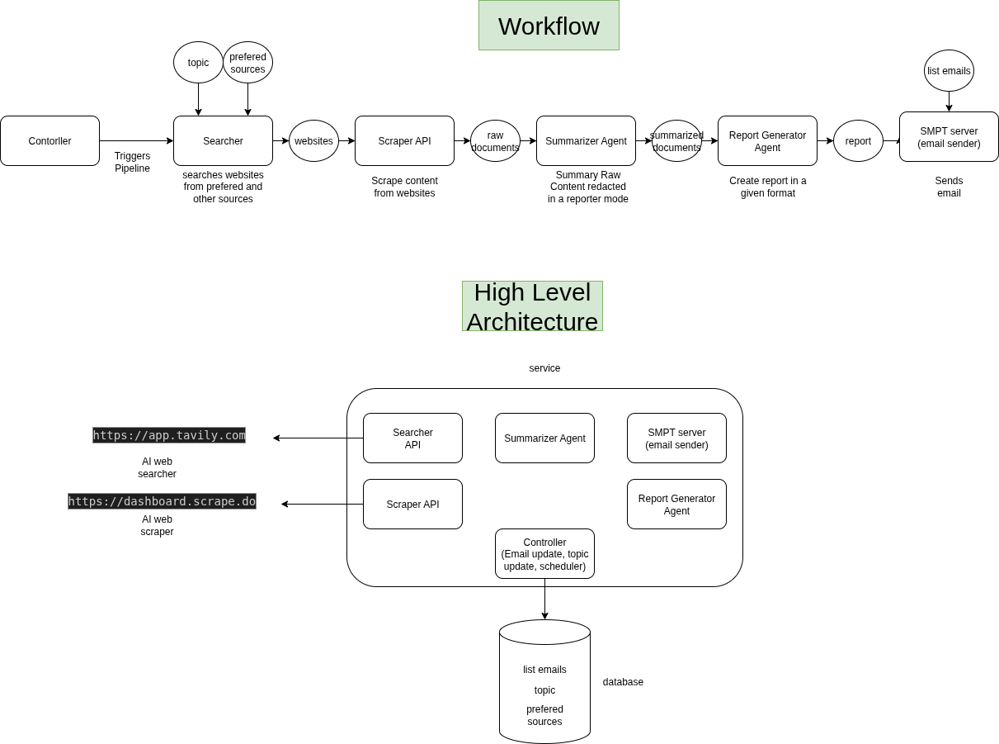

# agentNewsTask

## Concept

## 🧠 Architecture


### Essential

<pre lang="text"><code>
┌─────────────┐
│  Searcher   │────▶ https://app.tavily.com/home
└─────┬───────┘
      │
      ▼
┌──────────────┐
│   Scraper    │────▶ https://dashboard.scrape.do/
└─────┬────────┘
      ▼
┌──────────────┐
│ Summarizer?  │────▶ OpenAI / Local LLM (optional)
└─────┬────────┘
      ▼
┌──────────────────────┐
│  HTML Generator      │────▶ Formats newsletter
└─────┬────────────────┘
      ▼
┌─────────────┐
│ Mail Sender │────▶ Gmail / Mailgun / SMTP
└─────┬───────┘
      ▼
</code></pre>

# 📰 News AI Agents Service

A FastAPI-based microservice that:
- Searches for recent news articles
- Scrapes full article content
- Summarizes content with AI
- Generates an HTML report
- Sends the report via email

---

## 📂 Project Structure

```bash
├── main.py # FastAPI app and core orchestration
├── api/
│ ├── search.py # Handles news search API calls
│ └── scrape.py # Handles URL scraping logic
├── agents/
│ ├── summarizer.py # AI summarization logic
│ └── reportGenerator.py # HTML report generation
├── emailService/
│ └── smtp.py # SMTP client for sending emails
├── config.py # Loads settings from .env
├── payload.py # Pydantic schema for config input
└── .env # Environment variables
```

---

## ⚙️ Environment Configuration

Create a `.env` file in the project root with the following:

```env
SEARCH_URL=https://your-search-api
SEARCH_KEY=your_search_api_key

SCRAPER_URL=https://your-scraper-api
SCRAPER_KEY=your_scraper_api_key

SMTP_SERVER=smtp.mailjet.com
SMTP_PORT=587
SMTP_USERNAME=your_smtp_username
SMTP_PASSWORD=your_smtp_password
```

## Running the Server
Assuming the app is in a folder like my_app/:

```bash
bash service/run_app.sh
```

Running with docker compose

```bash
docker-compose up --build
```

NOTE: A .env file has to be populated

## API Endpoints

GET /
Returns a welcome message and current configuration.

Response:

```json
{
  "config": {
    "topic": "News AI Agents",
    "email": "jpvilla1990@gmail.com"
  },
  "message": "Welcome to the News AI Agents service!"
}
```
GET /pipeline
Triggers the full pipeline:

Search → Scrape → Summarize → Report → Email

Response:

```json
{
  "message": "Pipeline executed successfully.",
  "report": "Report has been sent to the emails."
}
```
POST /config
Update the topic and email used by the pipeline.

Request:

```json
{
  "topic": "AI in Finance",
  "email": "your_email@example.com"
}
```
Response:

```json
{
  "message": "Configuration updated successfully.",
  "config": {
    "topic": "AI in Finance",
    "email": "your_email@example.com"
  }
}
```

## Pipeline Overview
The Main.pipeline() method performs:

Search: using queries like:

Today DD-MM-YYYY

Week WW YYYY

Month MM-YYYY

Scrape: full content from each article.

Summarize: each article using AI.

Generate: a readable HTML report.

Send Email: using SMTP credentials.

## Email Output

HTML-formatted email with article summaries.

Sent via SMTP (e.g., Mailjet).

Requires SMTP credentials in .env.

This performs the search, scraping, summarizing, report generation, and sends the result to the configured email.

### Notes

View API docs at: http://localhost:8000/docs

FastAPI also provides a /redoc endpoint for alternative documentation.

You can easily containerize this with Docker if needed.

### Contact
Created by Juan Pablo Villa
Reach me at: jpvilla1990@gmail.com

```vbnet

Let me know if you'd like to include a Dockerfile or GitHub Actions deployment instructions next.
```